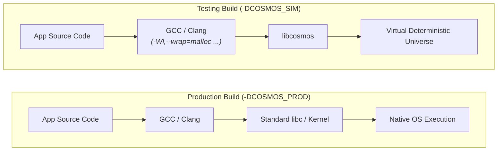
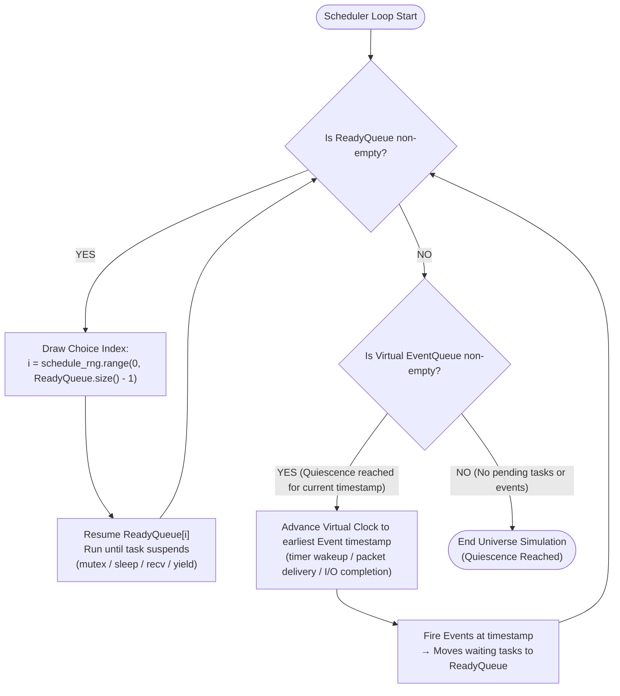

# Cosmos Library: Design & Public API Reference

This is the authoritative design document for `libcosmos`. It defines the architecture, standard POSIX function wrapping taxonomy, public interfaces, and semantics that make simulation runs deterministic and explorable.

---

## Table of Contents

1. [Concepts](#1-concepts)
2. [Build-Flag Swapping & Linker Interposition](#2-build-flag-swapping--linker-interposition)
3. [POSIX Standard Function Taxonomy](#3-posix-standard-function-taxonomy)
4. [Memory Subsystem Reference](#4-memory-subsystem-reference)
5. [Time Subsystem Reference](#5-time-subsystem-reference)
6. [Network Subsystem Reference](#6-network-subsystem-reference)
7. [Randomness Subsystem Reference](#7-randomness-subsystem-reference)
8. [Storage Subsystem Reference](#8-storage-subsystem-reference)
9. [Fault Injection Framework](#9-fault-injection-framework)
10. [Task & Concurrency API & Deterministic Scheduling](#10-task--concurrency-api--deterministic-scheduling)
11. [Data Generators (`gen.hpp`)](#11-data-generators-genhpp)
12. [Assertions (`assert.hpp`)](#12-assertions-asserthpp)
13. [Campaign Engine (`campaign.hpp`)](#13-campaign-engine-campaignhpp)
14. [The Determinism Contract](#14-the-determinism-contract)
15. [Error Handling & Tracing](#15-error-handling--tracing)
16. [Non-Goals (v1)](#16-non-goals-v1)

---

## 1. Concepts

| Term | Meaning |
|---|---|
| **Universe** | One `Simulator` instance running one seeded execution. |
| **Seed** | 64-bit seed value; fully determines a universe (same binary + seed ⇒ identical execution). |
| **Linker Wrapping** | GCC/Clang `-Wl,--wrap=symbol` mechanism that intercepts standard C/POSIX function calls and routes them to `libcosmos`. |
| **RNG Stream** | Independent deterministic PRNG stream derived from the master seed by domain: `schedule`, `fault`, `workload`, `user`. |
| **Task** | A user-space green thread / fiber task cooperatively scheduled by the universe. |
| **Node** | A simulated virtual machine/container: an ownership group for endpoints, memory, and tasks. |
| **Virtual Time** | `Time` (int64 nanoseconds since universe start). Advances only when no task is runnable, to the next event. |
| **Finding** | A violated `always` assertion (or crash) in some universe, or a `sometimes` assertion hit in **no** universe of a campaign. |
| **Campaign** | N universes over N seeds, run in parallel across CPU cores, aggregating findings and printing repro seeds. |

---

## 2. Build-Flag Swapping & Linker Interposition

Cosmos allows applications to be written using **100% standard POSIX C/C++ function calls**. Swapping between production and testing builds occurs at compile/link time:



### Build Configuration Matrix

| Build Flag | Linker Flags | Interposition Target | Runtime Backend |
|---|---|---|---|
| `-DCOSMOS_PROD` | None | Direct system calls | Real OS (`libc`, Linux kernel sockets) |
| `-DCOSMOS_SIM` | `-Wl,--wrap=malloc -Wl,--wrap=free -Wl,--wrap=pthread_create -Wl,--wrap=clock_gettime -Wl,--wrap=socket -Wl,--wrap=send -Wl,--wrap=recv -Wl,--wrap=write -Wl,--wrap=fsync -Wl,--wrap=getrandom` | `__wrap_*` functions | `libcosmos` (Static Library) |

---

## 3. POSIX Standard Function Taxonomy

The following table lists every standard POSIX function intercepted by `libcosmos` in testing builds:

| Category | Standard POSIX Function | Wrapped Symbol | Sim Mode Behavior |
|---|---|---|---|
| **Memory** | `malloc(size)` | `__wrap_malloc` | Allocates from tracked sim heap; checks OOM fault injection |
| | `free(ptr)` | `__wrap_free` | Deallocates from tracked sim heap; detects double-free bugs |
| | `calloc(nmemb, size)` | `__wrap_calloc` | Zero-initialized sim heap allocation |
| | `realloc(ptr, size)` | `__wrap_realloc` | Resizes tracked sim heap allocation |
| **Time** | `clock_gettime(clk_id, tp)`| `__wrap_clock_gettime` | Writes current virtual simulation time into `timespec` |
| | `gettimeofday(tv, tz)` | `__wrap_gettimeofday` | Writes current virtual simulation time into `timeval` |
| | `nanosleep(req, rem)` | `__wrap_nanosleep` | Suspends caller until virtual time reaches `now + req` |
| | `clock_nanosleep(clk, flags, req, rem)` | `__wrap_clock_nanosleep` | Suspends caller until `now + req`, or until `req` as an absolute deadline under `TIMER_ABSTIME` |
| **Network**| `socket(domain, type, p)` | `__wrap_socket` | Returns virtual socket descriptor bound to active Node |
| | `bind(fd, addr, len)` | `__wrap_bind` | Binds virtual socket descriptor to virtual port |
| | `listen(fd, backlog)` | `__wrap_listen` | Marks virtual socket descriptor as passive listener |
| | `accept(fd, addr, len)` | `__wrap_accept` | Blocks until incoming connection event arrives |
| | `connect(fd, addr, len)` | `__wrap_connect` | Initiates virtual connection event across sim network graph |
| | `send(fd, buf, len, flags)`| `__wrap_send` | Injects packet into sim network with latency/loss/reorder faults |
| | `recv(fd, buf, len, flags)`| `__wrap_recv` | Suspends caller until virtual packet delivery event arrives |
| | `close(fd)` | `__wrap_close` | Closes virtual socket descriptor / frees endpoint |
| **Storage**| `open(path, flags, mode)` | `__wrap_open` | Opens virtual file descriptor in sim disk subsystem |
| | `read(fd, buf, count)` | `__wrap_read` | Reads data from virtual page cache / disk image |
| | `write(fd, buf, count)` | `__wrap_write` | Appends dirty bytes to un-synced virtual page cache |
| | `fsync(fd)` | `__wrap_fsync` | Flushes un-synced page cache bytes to durable virtual storage |
| **Random** | `getrandom(buf, len, fl)` | `__wrap_getrandom` | Fills buffer with bytes from seeded `xoshiro256**` stream |
| | `random()` | `__wrap_random` | Returns a draw from the seeded `User` RNG stream |
| | `rand()` | `__wrap_rand` | Returns a draw from the seeded `User` RNG stream (shared with `random()`) |
| | `srandom(seed)`, `srand(seed)` | `__wrap_srandom`, `__wrap_srand` | Deterministic no-ops; host seeding never perturbs the `User` stream |
| **Threads / Sync** | `pthread_create(thread, attr, fn, arg)` | `__wrap_pthread_create` | Spawns green thread / fiber task in sim scheduler (no OS thread) |
| | `pthread_join(thread, retval)` | `__wrap_pthread_join` | Suspends current task until target green thread completes |
| | `pthread_mutex_lock(mutex)` | `__wrap_pthread_mutex_lock` | Locks sim mutex; suspends task on mutex wait queue if contested |
| | `pthread_mutex_unlock(mutex)` | `__wrap_pthread_mutex_unlock` | Unlocks sim mutex; unblocks waiting tasks to Ready Queue |
| | `pthread_cond_wait(cond, mutex)` | `__wrap_pthread_cond_wait` | Unlocks mutex, suspends task on condvar queue, yields to scheduler |
| | `pthread_cond_signal(cond)` | `__wrap_pthread_cond_signal` | Unblocks task waiting on condvar back to Ready Queue |
| | `sched_yield()` | `__wrap_sched_yield` | Yields current task to sim scheduler choice draw |

---

## 4. Memory Subsystem Reference

In testing builds (`-DCOSMOS_SIM`), `__wrap_malloc` and `__wrap_free` intercept heap operations:

- **OOM Fault Injection**: `__wrap_malloc`, `__wrap_calloc` and `__wrap_realloc` each ask the fault injector for one decision per eligible call (`FaultClass::Memory`, `SiteId::malloc` / `calloc` / `realloc`) and translate `OutOfMemory` to `nullptr` plus `errno = ENOMEM`. The decision happens before the heap is touched, so a fired OOM leaves `TrackedHeap` untouched and a failed `realloc` leaves the original block valid. Rates, budgets, windows and occurrence triggers come from the `FaultConfig` installed with `Simulator::install_faults` (`docs/fault-injection.md` §12). Eligibility: a `calloc` size-product overflow is a real API failure answered before the injector, `realloc(ptr, 0)` is a free, and a block this universe does not own is never faulted — none of the three consumes a draw. `malloc(0)` *is* eligible, since returning `nullptr` there is a legal C11 result.
- **Leak Detection**: When a universe completes, `Simulator` automatically verifies that `active_allocations() == 0`. Unfreed pointers are logged as findings with allocation backtraces and repro seeds.

---

## 5. Time Subsystem Reference

In testing builds, virtual time advances deterministically:

- **Virtual Clock Advancement**: Virtual time does **not** advance during CPU computation. It advances instantaneously to the next scheduled event timestamp when all tasks suspend.

---

## 6. Network Subsystem Reference

In testing builds, network calls route through an in-process simulated topology:

```cpp
struct Address {
    uint32_t node_id;
    uint16_t port;
};

class Net {
public:
    void partition(std::vector<uint32_t> group_a, std::vector<uint32_t> group_b);
    void heal_all();

    using Verdict = std::variant<Drop, DeliverAfter>;
    std::function<Verdict(const PacketView&)> on_send;
};
```

### Delivery Semantics:
1. `send()` consults partition maps → `on_send` hook → `Network`-class latency/loss draws.
2. Surviving packets become delivery events scheduled at `virtual_now + sampled_latency`.
3. Node crash closes endpoints and cancels pending `recv()` calls.

---

## 7. Randomness Subsystem Reference

```cpp
class Rng {
public:
    explicit Rng(uint64_t seed);
    static Rng derive(const Rng& parent, uint64_t domain);

    uint64_t next();
    uint64_t range(uint64_t lo, uint64_t hi);
    bool     coin(double p);
    double   uniform();
};
```

RNG stream domains: `Schedule=1`, `Fault=2`, `Workload=3`, `User=4`. Splitmix64 stream derivation ensures independent exploration dimensions across seeds.

---

## 8. Storage Subsystem Reference

**Today (point faults only).** `__wrap_open/read/write/fsync` ask the fault injector for one
decision per eligible call and translate it to a legal result — `EIO`/`ENOSPC` failures, or a
`ShortWrite` that performs a *real* partial transfer of `count / 2` bytes (write() reporting k
bytes must mean k bytes were transferred; claiming a short count without transferring would be
an impossible world). Decisions happen before the real call, so a faulted call has no side
effects. Eligibility: standard stream fds (0/1/2) and zero-length transfers never reach the
injector — logging must not consume Storage-stream draws, and no outcome is observable on an
empty transfer — so `fire_on_eligible_call` on `SiteId::write` counts only writes of
`count >= 1` to fds `>= 3`. 1-byte writes stay eligible: they can legally fail with
`EIO`/`ENOSPC` (a single-byte WAL commit marker is a real shape); the one degenerate case is a
fired `ShortWrite` on a 1-byte write, which has no legal short observable and observably
degrades to a complete write. The page-cache/durability model below is layered on later.

Simulates page-cache buffering, `fsync` durability, and torn writes upon crash-reboot:

- `write()` buffers dirty bytes in simulated un-synced page cache.
- `fsync()` commits buffered pages to durable storage.
- On `sim.crash(node)` followed by `sim.reboot(node)`: un-synced pages are discarded, and the last synced region may experience torn writes drawn from the `Storage` class.

---

## 9. Fault Injection Framework

Configuration is `FaultConfig` (`docs/fault-injection.md` §12): per-class enable bits, per-site
activation, and a per-site `FaultRule` carrying rate, `skip_first`, `max_injections`, a weighted
outcome table and an optional occurrence trigger. It is installed once per universe with
`Simulator::install_faults(cfg, node_count)`, which derives the injector's seed from the `Fault`
stream domain (Rule 1) and binds it to that universe's clock.

```cpp
FaultConfig cfg;
cfg.enable_class(FaultClass::Memory);
cfg.activate_site(SiteId::malloc);

FaultRule oom;
oom.rate = 0.001;
oom.outcomes.add(FaultKind::OutOfMemory, 1.0);
cfg.set_rule(SiteId::malloc, oom);

sim.install_faults(std::move(cfg));
```

Four composable fault mechanisms:
1. **Declarative Config**: rates applied automatically via the `fault` RNG stream.
2. **Imperative Scripting**: `sim.net().partition(...)`, `sim.crash(node)`, `sim.reboot(node)`.
3. **Scheduled Faults**: `sim.at(10s, [&]{ sim.net().partition(a, b); })`.
4. **Custom Verdict Hooks**: Programmatic control via `sim.net().on_send`.

---

## 10. Task & Concurrency API & Deterministic Scheduling

Cosmos supports standard POSIX `pthread` concurrency in application code with zero code modification (`pthread_create`, `pthread_join`, `pthread_mutex_*`, `pthread_cond_*`).

### How `pthread` Interposition Works (`-Wl,--wrap=pthread_create`)

In testing builds (`-DCOSMOS_SIM`), **no OS threads are created**. The entire simulation universe executes inside a single physical OS thread. Standard `pthread` calls are mapped to user-space green threads / fibers managed by Cosmos's single-threaded scheduler:

- **`__wrap_pthread_create(thread, attr, start_routine, arg)`**: Allocates a user-space task frame (green thread), pushes it to the scheduler's `ReadyQueue`, and assigns a virtual thread ID.
- **`__wrap_pthread_mutex_lock(mutex)`**: If the virtual mutex is free, acquires it immediately. If locked, moves the current task from `ReadyQueue` to the mutex's `WaitQueue` and yields execution to the scheduler.
- **`__wrap_pthread_mutex_unlock(mutex)`**: Releases the virtual mutex, moves waiting tasks from `WaitQueue` back to `ReadyQueue`, and yields to the scheduler choice point.
- **`__wrap_pthread_cond_wait(cond, mutex)`**: Atomically releases the mutex, moves the current task to the condition variable's `WaitQueue`, and yields control to the scheduler.
- **`__wrap_pthread_cond_signal(cond)`**: Unblocks one or all tasks from the condition variable queue, returning them to the `ReadyQueue`.

### Deterministic Scheduler Loop Algorithm

Every context switch decision is driven by the seeded `schedule` RNG stream:



### Why Determinism Holds under `pthread` Wrapping:
1. **Single-Threaded Execution**: Eliminates OS kernel thread preemption, CPU core cache line races, and hardware interrupt timing jitter.
2. **Seeded Choice Draws**: When multiple tasks are runnable, `schedule_rng` chooses which task runs next. A specific seed reproduces the **exact same sequence of thread interleavings**.
3. **Exploration**: Different seeds explore different valid interleavings, exposing race conditions, deadlocks, and missed condition signals.

---

## 11. Data Generators (`gen.hpp`)

Property-testing-style generators drawing from the `workload` RNG stream:

```cpp
namespace cosmos::gen {
    uint64_t range(Rng&, uint64_t lo, uint64_t hi);
    bool     coin(Rng&, double p);
    template<typename T> T one_of(Rng&, std::initializer_list<T>);
    std::string string(Rng&, size_t len);
    Duration exponential(Rng&, Duration mean);
}
```

---

## 12. Assertions (`assert.hpp`)

```cpp
namespace cosmos {
    void always(bool cond, std::string id, std::string detail = "");
    void sometimes(bool cond, std::string id);
    inline void reachable(std::string id) { sometimes(true, id); }
}

#define COSMOS_CHECK(cond, id) ::cosmos::always((cond), (id), \
        std::string(__FILE__) + ":" + std::to_string(__LINE__))
```

- `always`: Invariant property evaluated per universe. Violation = immediate finding.
- `sometimes`: Liveness/coverage property evaluated across all universes in a campaign. Must be hit at least once.

---

## 13. Campaign Engine (`campaign.hpp`)

```cpp
struct CampaignConfig {
    uint64_t trials    = 1000;
    uint64_t base_seed = 0;
    unsigned parallel  = std::thread::hardware_concurrency();
    bool     verify    = false;   // double-run verification mode
};

struct CampaignReport {
    uint64_t runs, failed_runs;
    std::vector<Failure> findings;
    std::vector<std::string> never_hit;
};

class Campaign {
public:
    static CampaignReport run(CampaignConfig, std::function<void(Simulator&, uint64_t)> build_fn);
};
```

---

## 14. The Determinism Contract

Under `libcosmos`, determinism holds provided that application code:
1. Accesses time only via POSIX time functions (`clock_gettime`) or `sim.now()`.
2. Draws randomness only via POSIX random functions (`getrandom`) or `sim.rng()`.
3. Performs I/O only via POSIX socket/file calls.
4. Avoids iteration dependencies on raw pointer addresses (ASLR leaks).

---

## 15. Error Handling & Tracing

- Findings output a clear repro command: `myapp_test --seed 12345`.
- Tracing sink records FNV-1a event hash (`trace_hash`) used by `--verify` double-run validation.

---

## 16. Non-Goals (v1)

- Multi-process universes inside a single simulation trial (handled in Phase 7 via `KvmSubstrate`).
- Real OS thread preemption inside a simulation universe (simulations run single-threaded and cooperative for perfect reproducibility).
