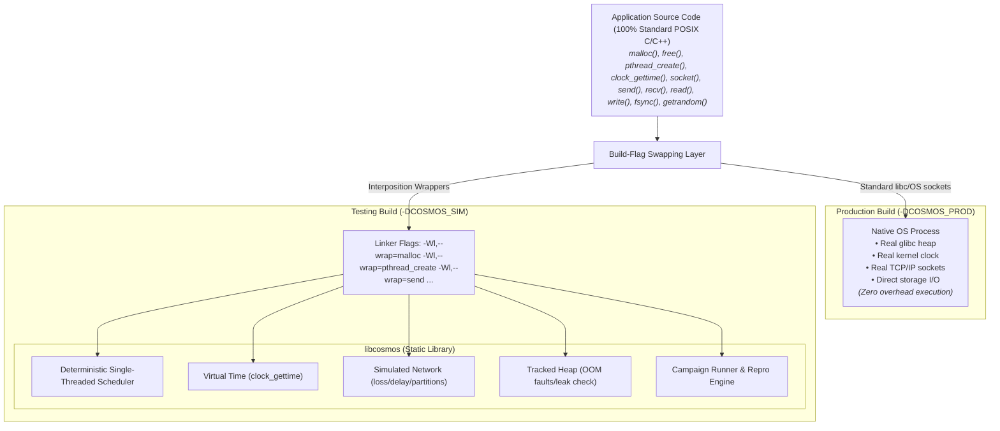

# Cosmos - Deterministic Simulation Testing as a C++ Library

Cosmos is an embeddable C++ library for **deterministic simulation testing (DST)**.
It provides **standard POSIX library function mimicry** (`malloc`, `free`, `pthread_create`, `clock_gettime`, `socket`, `send`, `recv`, `getrandom`, `fsync`, etc.) and **build-flag symbol interposition** (`-Wl,--wrap`).

Application developers write standard C/POSIX code. In production builds, the application compiles normally with standard system libraries and direct OS system calls (zero overhead). In testing builds, Cosmos intercepts standard function calls via linker wrapping (`-Wl,--wrap`) and links statically against **`libcosmos`**, routing execution into a fully deterministic, fault-injecting, state-space-exploring simulated world - the same architecture as FoundationDB's simulator and TigerBeetle's VOPR, packaged as a reusable library with zero code modification required.

> **Architecture Focus:** The library design centers around **standard POSIX function mimicry** and **linker symbol wrapping** (`-Wl,--wrap`) via **`libcosmos`**. Applications do not need to be rewritten against custom framework runtime objects. The same source code compiles into a production binary (native OS execution) and a testing binary (`libcosmos` static link with virtual clock, tracked heap, single-threaded scheduler, simulated network, and fault injection).

---

## Table of Contents

1. [Decisions](#1-decisions)
2. [What "Standard Library Mimicry DST" Means](#2-what-standard-library-mimicry-dst-means)
3. [Core Design (How Determinism is Achieved)](#3-core-design-how-determinism-is-achieved)
4. [Public API & POSIX Function Taxonomy](#4-public-api--posix-function-taxonomy)
5. [How Users Define Faults](#5-how-users-define-faults)
6. [How Simulation Data/Workloads Are Generated](#6-how-simulation-dataworkloads-are-generated)
7. [State-Space Exploration](#7-state-space-exploration)
8. [The Determinism Contract (User Obligations)](#8-the-determinism-contract-user-obligations)
9. [Roadmap](#9-roadmap)
10. [Risks](#10-risks)
11. [Repo Layout](#11-repo-layout)

Full API reference: **`docs/design.md`**. Architecture & Seams: **`docs/architecture.md`**. Antithesis research: **`docs/antithesis-study-notes.md`**.

---

## 1. Decisions

| Decision | Choice | Rationale |
|---|---|---|
| Language | **C++23** | User requirement; C++23 std::expected, std::flat_map, std::print, and modern type safety; fibers for wrapped pthread execution. |
| Interface Surface | **POSIX Standard Library Mimicry** (`malloc`, `pthread_create`, `clock_gettime`, `socket`, `send`, `recv`, `getrandom`, etc.) | App code stays 100% standard POSIX C/C++. No proprietary framework wrappers required in user codebase. |
| Build Swapping | **Linker Symbol Wrapping** (`-Wl,--wrap=malloc ...`) | Zero code modification. Testing build links `libcosmos` statically with linker flags; Production build links native OS `libc`/sockets with zero overhead. |
| Delivery Form | **`libcosmos` (Static Library)** | Single static library linked into the testing binary for deterministic simulation runs. |
| Execution Substrate | **In-process, single-threaded simulation** (`SimSubstrate`) | One deterministic cooperative scheduler + virtual time + seeded RNG + simulated I/O = reproducible-by-seed executions. |
| Concurrency Model | **Single-Threaded Fiber / Task Scheduler** | Intercepts `pthread_create` to run user-space tasks on one OS thread. The scheduler controls all interleavings. |
| Memory Management | **Deterministic Tracked Heap** (`__wrap_malloc` / `__wrap_free`) | Heap allocator tracks allocations, checks for memory leaks, and injects OOM faults deterministically per seed. |
| Exploration Engine | **Seeded fuzzing across parallel trials** | Each trial = 1 universe; parallelized across cores; coverage guidance (`sancov`) + `Snapshot`-based branching later. |
| Hypervisor Substrate | **Future substrate** (`KvmSubstrate : ISubstrate`, Phase 7+) | Reuses the determinism engine via Seam B for unmodified multi-process guest OS VM binaries. |
| Production Binary | **Native POSIX Build (`-DCOSMOS_PROD`)** | Same app source, two binaries: `myapp_test` (links `libcosmos` with `--wrap`) and `myapp` (links native OS `libc`, normal OS process). |

---

## 2. What "Standard Library Mimicry DST" Means



One `Simulator` instance = one universe. A **campaign** runs thousands of
universes with different seeds (across all cores), aggregates assertion
results, and prints a repro command (`--seed 12345`) for every failure.
Every failure replays **exactly**, because the whole universe is a function
of its seed.

---

## 3. Core Design (How Determinism is Achieved)

Determinism comes from controlling six key subsystems via standard function wrapping:

1. **Memory**: `malloc`, `free`, `calloc`, `realloc` are wrapped (`__wrap_malloc`). The sim allocator uses a seeded layout, tracks active allocations for leak detection, and injects OOM faults on configured probabilities.
2. **Scheduling**: `pthread_create`, `pthread_join`, `pthread_mutex_lock`, `pthread_mutex_unlock`, `pthread_cond_wait`, `pthread_cond_signal`, `sched_yield` are wrapped (`__wrap_pthread_create`). A single-threaded scheduler runs all tasks on one OS thread. Choice points (task selection) draw from the seeded `schedule` RNG stream.
3. **Time**: `clock_gettime`, `gettimeofday`, `nanosleep` are wrapped (`__wrap_clock_gettime`). Virtual time advances only when no task is runnable, to the next scheduled event.
4. **Randomness**: `random`, `getrandom` are wrapped (`__wrap_getrandom`). Drawn from domain-isolated PRNG streams (`schedule`, `fault`, `workload`, `user`).
5. **Network & I/O**: `socket`, `bind`, `connect`, `send`, `recv`, `close` are wrapped (`__wrap_send`/`recv`). Every network call is delivered through an in-process simulated topology with seeded fault injection (loss, delay, reorder, partition).
6. **Storage**: `open`, `read`, `write`, `fsync` are wrapped (`__wrap_write`). Writes update virtual page caches; `fsync` commits durable state; crash-reboot discards un-synced pages and simulates torn writes.

---

## 4. Public API & POSIX Function Taxonomy

### Standard POSIX Function Interposition Taxonomy

| POSIX Function | Wrapped Sim Implementation | Behavior under `libcosmos` (`TEST`) | Behavior under `PROD` |
|---|---|---|---|
| `malloc(size)` | `__wrap_malloc` | Deterministic heap alloc, leak tracking, OOM fault injection | Standard `libc` `malloc` |
| `free(ptr)` | `__wrap_free` | Deterministic heap dealloc, double-free validation | Standard `libc` `free` |
| `pthread_create(...)` | `__wrap_pthread_create` | Spawns green thread / fiber task in sim scheduler (no OS thread) | Standard `libpthread` |
| `pthread_mutex_lock(...)`| `__wrap_pthread_mutex_lock` | Locks sim mutex; suspends task on mutex wait queue if contested | Standard `libpthread` |
| `pthread_mutex_unlock(...)`| `__wrap_pthread_mutex_unlock` | Unlocks sim mutex; unblocks waiting tasks to Ready Queue | Standard `libpthread` |
| `clock_gettime(clk, ts)` | `__wrap_clock_gettime` | Returns virtual simulation clock time | Standard `libc` `clock_gettime` |
| `nanosleep(req, rem)` | `__wrap_nanosleep` | Suspends current task until virtual time reaches `now + req` | Standard `libc` `nanosleep` |
| `clock_nanosleep(clk, flags, req, rem)` | `__wrap_clock_nanosleep` | Suspends current task until `now + req`, or until `req` as an absolute deadline under `TIMER_ABSTIME` | Standard `libc` `clock_nanosleep` |
| `getrandom(buf, len, flags)`| `__wrap_getrandom` | Draws bytes from seeded `xoshiro256**` RNG stream | Standard OS `getrandom` |
| `socket(domain, type, proto)`| `__wrap_socket` | Creates virtual endpoint handle in sim network graph | Standard kernel `socket` |
| `send(fd, buf, len, flags)` | `__wrap_send` | Enqueues packet event in sim network with latency/loss faults | Standard kernel `send` |
| `recv(fd, buf, len, flags)` | `__wrap_recv` | Suspends task until virtual packet delivery event arrives | Standard kernel `recv` |
| `write(fd, buf, count)` | `__wrap_write` | Appends data to simulated un-synced page cache | Standard kernel `write` |
| `fsync(fd)` | `__wrap_fsync` | Flushes simulated page cache to durable storage | Standard kernel `fsync` |

---

## 5. How Users Define Faults

Four composable mechanisms (details in `docs/design.md` §9):

1. **Declarative config**: rates applied by the `fault` RNG stream:
   ```cpp
   FaultConfig cfg;
   cfg.enable_class(FaultClass::Memory);
   cfg.activate_site(SiteId::malloc);

   FaultRule oom;
   oom.rate = 0.001;                          // malloc OOM fault injection rate
   oom.outcomes.add(FaultKind::OutOfMemory, 1.0);
   cfg.set_rule(SiteId::malloc, oom);

   sim.install_faults(std::move(cfg));
   ```
2. **Imperative / Scripted**: from workload or scheduled actions:
   ```cpp
   sim.net().partition({n0, n1}, {n2, n3});   // split brain
   sim.net().heal_all();
   sim.crash(n2); sim.reboot(n2);
   ```
3. **Custom Verdict Hooks**: full programmatic control per packet or I/O op:
   ```cpp
   sim.net().on_send = [&](const PacketView& p) -> Verdict {
       if (p.to == n3 && rng.coin(0.5)) return Drop{};
       return DeliverAfter{gen::range(rng, 1, 20) * 1ms};
   };
   ```
4. **Storage & Memory Durability Semantics**: writes require `fsync` for durability; crash-reboot discards un-synced pages and may tear the last synced sector. `malloc` calls may fail with `ENOMEM` based on `oom_rate`.

---

## 6. How Simulation Data/Workloads Are Generated

1. **Seeded Generators** (`gen.hpp`): Property-testing-style combinators (`range`, `one_of`, `string`, `exponential`) drawing from the `workload` stream.
2. **Swarm Configuration**: The campaign derives per-run config parameters (message rates, key space size, fault intensities) from the seed, ensuring each trial explores a distinct configuration regime.
3. **Fixtures**: Initial state (e.g. preloaded keys) supplied by the harness at universe construction.

---

## 7. State-Space Exploration

- **v1 (MVP)**: Seeded fuzzing campaign. Each seed = one universe; trials run in parallel across CPU cores.
  - `always(cond, id)`: any violation = finding, printed with `--seed S` repro command.
  - `sometimes(cond, id)`: evaluated across the whole campaign (liveness/coverage).
- **v2**: Coverage-guided seed selection (`-fsanitize-coverage=trace-pc-guard` edge counts fed back to prefer novel seeds).
- **v3**: `fork()`-based universe branching at choice points (cheap COW snapshots), decision-log minimization (delta-debug failing runs to minimal repros), and trace export.

---

## 8. The Determinism Contract (User Obligations)

Under `libcosmos`, determinism is guaranteed **if** application code obeys these rules:

1. Use standard POSIX time APIs (`clock_gettime`, `gettimeofday`) - do not bypass wrapping to read hardware TSC directly.
2. Use standard POSIX random APIs (`getrandom`, `random`) - do not read `/dev/urandom` directly.
3. Use standard POSIX threads / wrapped sockets - do not bypass wrapped `pthread_create` or un-wrapped OS sockets inside a simulation.
4. Avoid iteration-order dependencies on raw pointer memory addresses (ASLR leaks).
5. Floating point operations must avoid non-deterministic fast-math flags (`-ffast-math`) in behavior-critical paths.

---

## 9. Roadmap

| Phase | Content | Exit criteria |
|---|---|---|
| 0 | Study notes & design specification - done (`docs/`) | Docs complete |
| 1 | **Core Runtime & Linker Wrapper Engine**: `libcosmos` static library with `-Wl,--wrap` for `malloc`, `free`, `pthread_create`, `clock_gettime`, `getrandom`; virtual clock and fiber scheduler | Same seed ⇒ bit-identical trace hash; standard C app builds in both test and prod modes |
| 2 | **Simulated Network & Socket Wrapping**: Linker wrapping for `socket`, `bind`, `connect`, `send`, `recv`; latency/loss/reorder/partition faults | Ping-pong application survives network faults deterministically |
| 3 | **Workloads & Campaign Runner**: `gen::*` combinators, multi-core parallel campaign runner, repro CLI, double-run trace verification | 10k-seed campaign across cores; findings replay exactly |
| 4 | **Simulated Storage & File Wrapping**: Linker wrapping for `open`, `read`, `write`, `fsync`; torn writes and crash durability model | KV store example detects lost-write bug under crash faults |
| 5 | **Exploration v2/v3**: Sancov guidance, `Snapshot` branching, decision-log minimization, chrome-trace export | Minimized repro traces and branching map |
| 6 | **Production Hardening**: Full native production build verification, packaging, comprehensive documentation | Example app runs reliably in both test and prod modes |
| 7 | **Hypervisor Substrate**: `KvmSubstrate : ISubstrate` - run unmodified VM binaries deterministically | Reuses Phases 1-5 engine |

---

## 10. Risks

1. **Unwrapped OS Calls**: Third-party code bypassing wrapped POSIX functions to call raw syscalls (`syscall(SYS_...)`). Mitigated by `--verify` mode and interposition traps.
2. **ASLR / Pointer Order Leaks**: Unordered containers keyed by raw pointer values (`std::unordered_map<T*>`). Mitigated by deterministic allocation layouts in `__wrap_malloc`.
3. **Fiber Context Switch Overhead**: Mitigated by custom lightweight fiber context switching.

---

## 11. Repo Layout

```
cosmos/
├── README.md                    ← project summary & quick start
├── CMakeLists.txt               ← defines libcosmos static library, examples
├── docs/
│   ├── plan.md                  ← this file
│   ├── architecture.md          ← build-flag layer, linker interposition, substrate seams
│   ├── design.md                ← full POSIX API taxonomy & public header reference
│   └── antithesis-study-notes.md← research background
├── include/cosmos/              ← public headers (sim engine & campaign harness)
│   ├── cosmos.hpp  task.hpp  time.hpp  random.hpp
│   ├── simulator.hpp  net.hpp  faults.hpp  gen.hpp  assert.hpp  campaign.hpp
│   └── (storage.hpp - Phase 4)
├── src/cosmos/                  ← libcosmos: __wrap_* functions, Universe, ISubstrate, SimSubstrate
└── examples/
    ├── CMakeLists.txt           ← builds single_node and distributed targets
    ├── single_node/             ← single binary example: transactional WAL storage engine (crash durability & OOM faults)
    │   ├── CMakeLists.txt
    │   └── kv_store.c
    └── distributed/             # distributed example: replicated consensus cluster (network partitions & reordering)
        ├── CMakeLists.txt
        └── replicated_kv.c
```
